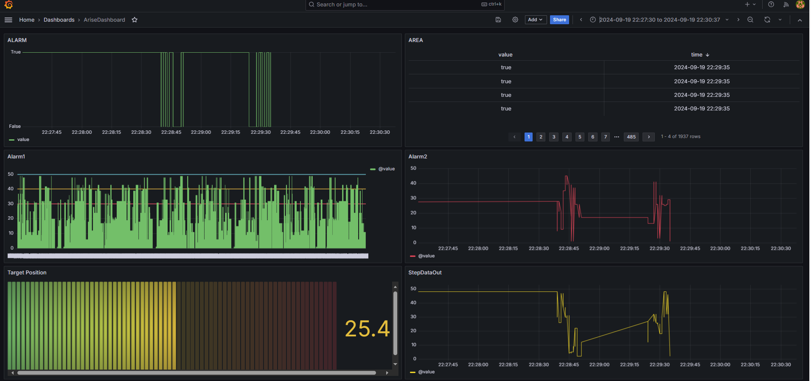
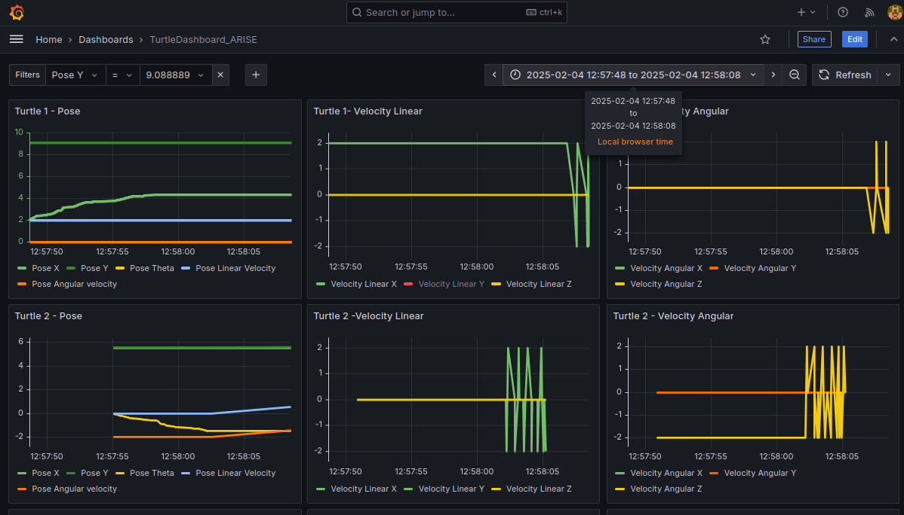
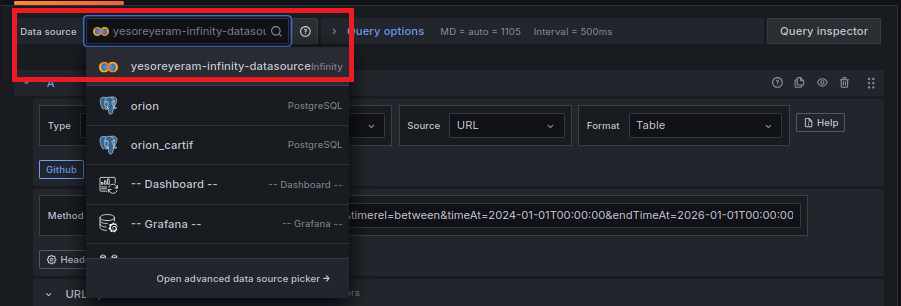
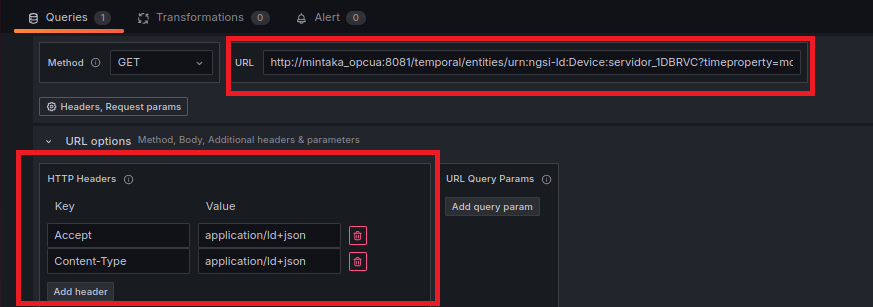
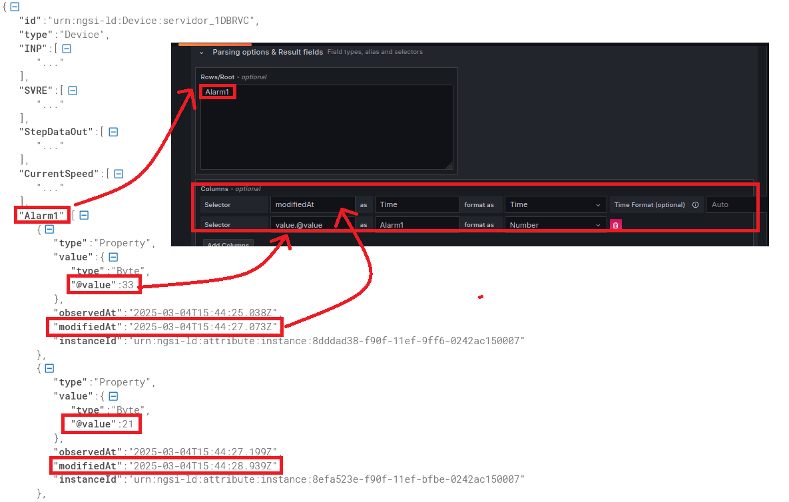
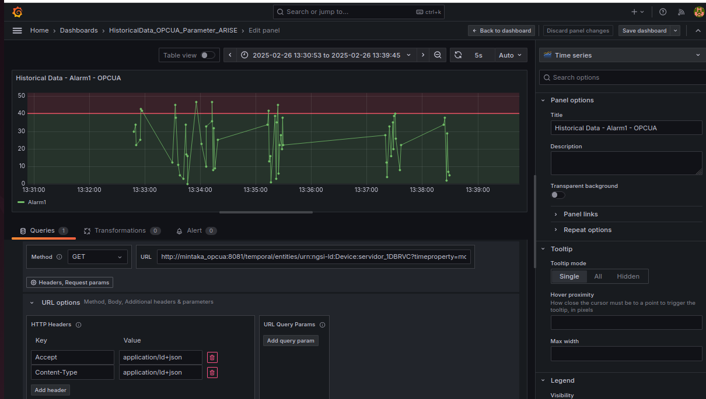
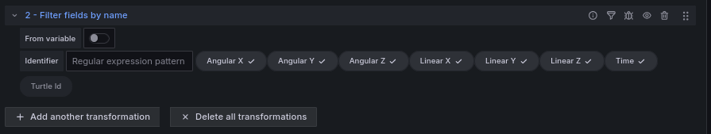
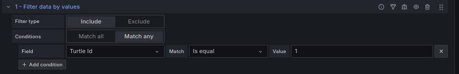

.. raw:: html

   

     
   

   

    
    
   

=======================
ARISE PoC Guide
=======================

Overview
========

The ARISE Proof of Concept (PoC) is a FIWARE-based Minimum Viable Platform (MVP) composed of various Docker containers, which encapsulate the application code along with all its dependencies to ensure it runs consistently and reliably across different computing environments.
This containerized approach simplifies deployment, eliminates dependency conflicts, and provides a scalable platform for testing and validation.

This tutorial is a step-by-step guide that demonstrates how to set up the necessary components and workflows, in order to enable the ARISE PoC to connect seamlessly with various information sources. It also provides the means to test a wide range of use cases (UCs) defined and implemented in the Test and Experimentation Facilities (TEFs).

.. raw:: html

   

     
   

Actors
======

The actors involved in the scenario are:

**OPC UA Server**
   It represents the data source utilized by the TEF.

**IoT Agent OPC UA**
   The connector through which to join the industrial environment to this FIWARE-based platform can be configured as described in `Documentation <https://github.com/Engineering-Research-and-Development/iotagent-opcua/blob/master/docs/user_and_programmers_manual.md>`_ and in `GitHub <https://github.com/Engineering-Research-and-Development/iotagent-opcua/tree/master>`_.
   In order to start working with the above mentioned OPC UA server, configuration files have been already edited and made available in the *conf* folder.

**ROS2/FastDDS**
   This connector implements both an Application Programming Interface (API) and a communication protocol that deploys a Data-Centric Publisher-Subscriber (DCPS) model, with the purpose of establishing efficient and reliable information distribution among Real-Time Systems.
   More information can be found here in `Documentation <https://fast-dds.doc.eprosima.com/en/latest/>`_ and in `GitHub <https://github.com/FIWARE/context.Orion-LD/tree/develop/demo/ros2>`_

**Orion LD Context Broker**
   It is the entry point of each FIWARE platform that adopts the NGSI LD data model. It can be external, however, in order to ensure a self-contained and self-consistent testing environment, it is included in this PoC as part of the Docker Compose setup.
   More information can be found here in `Documentation <https://github.com/FIWARE/context.Orion-LD/tree/develop/doc/manuals-ld>`_ and in `GitHub <https://github.com/FIWARE/context.Orion-LD>`_

**MongoDB**
   The database that saves the current state of the data passed through the context broker. It is used by the Orion LD to hold context data information such as data entities, subscriptions and registrations.
   More information can be found in `Documentation <https://www.mongodb.com/docs/manual/>`_ and in `GitHub <https://github.com/mongodb/mongo>`_

**Mintaka**
   It is a Generic Enabler (GE) of the FIWARE ecosystem designed for time series data storage and management. It serves as a lightweight, scalable API that allows the ingestion, querying, and analysis of historical context information from FIWARE Context Brokers. More information can be found in `Documentation <https://github.com/FIWARE/mintaka?tab=readme-ov-file#documentation>`_ and in `GitHub <https://github.com/FIWARE/mintaka>`_

**TimescaleDB**
   It is a time series database built on PostgreSQL, designed to handle large-scale, time-stamped data efficiently. It offers powerful SQL support for managing time series data, with features like automatic data partitioning, real-time aggregation, and advanced query capabilities. More information can be found in `Documentation <https://docs.timescale.com/>`_ and in `GitHub <https://github.com/timescale/timescaledb>`_

**Grafana**
   It is an open-source analytics and visualization platform that allows users to visualize data stored in TimeScaleDB through customizable dashboards.
   It supports data representation using charts, graphs, tables, and alerts. Besides TimeScaleDB, Grafana integrates with a wide range of data sources, including Prometheus, InfluxDB, MySQL, PostgreSQL, Elasticsearch, and more.
   It is released under the Apache License 2.0. More information can be found in `Documentation <https://grafana.com/>`_ and in `GitHub <https://github.com/grafana/grafana>`_.

Step-by-step Guide
===================

This section outlines the process for rapidly deploying a fully functional testbed that includes all relevant actors.

Requirements
------------

- Docker (Version 26.1.5)
- Docker-compose (Version 1.29+)
- RAM 8GB minimum

**Install docker and docker-compose** by following the instructions available on the official web site:

- Docker: `here <https://docs.docker.com/install/linux/docker-ce/ubuntu/>`_
- Docker-Compose: `here <https://docs.docker.com/compose/install/>`_

**Verify Installation**: Run the following commands to check Docker and Docker Compose:

.. code-block:: bash

   docker --version
   docker compose --version

Step 1 - Clone the ARISE PoC
-----------------------------

Open a terminal and move into a folder in which to create the new folder containing the ARISE PoC components.

Then run:

.. code-block:: bash

   git clone "https://github.com/Engineering-Research-and-Development/arise-poc.git"

Step 2 - Configure the ARISE PoC
---------------------------------

Before launching the ARISE PoC, it is essential to edit the docker-compose.yaml file and configure IoT Agent OPC UA service to align with your specific OPC UA Server's specifications.

.. code-block:: bash

   cd arise-poc/
   nano docker-compose.yaml

Here are some environment variables that must be configured:

- ``IOTA_CB_SERVICE`` allows to define where the OPCUA IoT Agent sends NGSI-LD context data;
- ``IOTA_SERVICE`` defines the devices are registered;
- ``IOTA_OPCUA_ENDPOINT`` is used in FIWARE IoT Agent for OPC UA to specify the OPC UA server endpoint.

For a more complete description on how to configure the IoT Agent, go to `link <https://github.com/Engineering-Research-and-Development/iotagent-opcua/blob/master/docs/howto.md>`_.

Step 3 - Build & Run the ARISE PoC
-----------------------------------

To launch the whole PoC:

.. code-block:: bash

   docker compose up --build -d

After that you can run:

.. code-block:: bash

   docker ps

to check if all the required components are running.

.. raw:: html

   

     
   

Before starting the ROS2 demo, as X11 session owners, other users must be allowed to use the X Window System (to show the turtles on screen). For that, the following command is executed:

.. code-block:: bash

   xhost local:root

When the dockers have started, connect to bash in the container of ros2:

.. code-block:: bash

   docker exec -ti ros2 bash

Now the TurtleSim and the Keyboard controller can be started:

.. code-block:: bash

   source /ros2-ws/install/setup.bash

   # Show the turtles on the screen
   ros2 run docs_turtlesim turtlesim_node_keys &

   # Keyboard controller to move the turtles.
   ros2 run docs_turtlesim turtlesim_multi_control

.. raw:: html

   

     
   

Step 4 - Access the Grafana Dashboard
--------------------------------------

In the context of the ARISE PoC, Grafana is used to visualize and analyze the data collected from OPC UA and ROS2 devices, offering an intuitive interface to monitor the performance, and trends of connected systems.
This tool plays a critical role in helping users test various use cases by providing a clear view of the data flow and operational metrics. Grafana is distributed under the Apache License 2.0, ensuring that it is free to use, modify, and distribute.
Its active open-source community and extensive documentation make it accessible to users of all expertise levels. 
For more details, including installation guides, plugins, and advanced configuration options, visit the official Grafana website at https://grafana.com/.

For this PoC, Grafana is accessible at the link https://localhost/login using the default credentials admin/admin

Configuring a DataSource
~~~~~~~~~~~~~~~~~~~~~~~~~

In Grafana the Timescale datasource can be configured using the datasources.yaml file, which is part of Grafana's provisioning system. 
This allows for automated setup and consistent configuration of the datasource when Grafana starts. 
TimescaleDB, a powerful time-series database built on PostgreSQL, integrates seamlessly with Grafana, enabling efficient visualization of time-series data.

To configure the TimescaleDB datasource, follow these steps:

.. code-block:: bash

   cd arise-poc\conf\grafana\datasources
   nano datasources.yaml

.. raw:: html

   

     
   

When the ARISE PoC is executed, this datasource.yaml file is mounted into the Grafana's provisioning folder to ensure proper configuration and access to the necessary data sources.

Creating a new Dashboard
~~~~~~~~~~~~~~~~~~~~~~~~~

Creating a new dashboard in Grafana allows you to visualize and analyze your data effectively. Here's a step-by-step guide to help you set up a new dashboard:

- Log in Grafana instance and click on the "+" icon in the top right menu, selecting "New Dashboard";

.. raw:: html

   

     
   

- Click on "Add a new panel" and in the Query section, choose your data source.

.. raw:: html

   

     
   

   

     
   

- Construct your query to fetch the desired data, selecting the appropriate visualization type (e.g., graph, table, gauge) from the options. More information on how to structure queries useful for creating dashboards can be found in the `Example Query Dashboard`_ section of the present tutorial

.. raw:: html

   

     
   

   

     
   

- To configure Panel Settings, you adjust the visualization settings such axes, legends, and thresholds
- Save the Panel and the Dashboard

Example Dashboard in ARISE PoC
~~~~~~~~~~~~~~~~~~~~~~~~~~~~~~~

For the ARISE Proof of Concept (PoC), example dashboards have been developed to graphically represent data from both OPC UA devices and ROS2 devices.

**Dashboard for data from an OPCUA device**

As shown in the figure, this example dashboard is based on some of the data produced by an OPCUA device provided by TEF of CARTIF for the ARISE research project. Specifically, the following parameters have been selected and represented from the entity implemented on the device: ALARM, Alarm1, Alarm2, Area, Target Position, and Step Data Out.

**Dashboard for data from an ROS2 device**

This example dashboard represents the data of the entity defined in a ROS2 device. Specifically, for the ARISE research project, three turtlesim instances have been implemented as ROS2 devices, and for each of them, the following data is represented:

- **Turtle Pose**: This includes the turtle's linear velocity, its position coordinates (X and Y), and the orientation angle (Theta). These parameters provide crucial information about the turtle's current location and direction of movement in the coordinate system.

- **Turtle Linear Velocity**: This metric indicates the speed at which the turtle is moving in a straight line. It is essential for understanding the turtle's movement dynamics and can be visualized as a gauge or graph, showing real-time changes in speed.

- **Turtle Angular Velocity**: This metric represents the speed of rotation around the Z-axis. Angular velocity is critical for analyzing how quickly the turtle can change its direction, which is particularly important in dynamic environments or when navigating complex paths.

By visualizing these parameters on the dashboard, users can monitor the performance and behavior of the turtlesim devices in real-time. The dashboard facilitates a comprehensive overview of the turtles' movements, allowing for effective analysis and decision-making during experiments.

**Dashboard for historical data using Mintaka**

To building dashboards with historical data, the Grafana instance in ARISE PoC integrates the "Grafana Infinity Datasource" plugin, which allows external APIs to be added as data sources, supporting various formats such as JSON, XML, and more.

More information about this plugin are available at the following `link <https://grafana.com/grafana/plugins/yesoreyeram-infinity-datasource/>`_

The APIs to access historical data are provided by Mintaka, a FIWARE Generic Enabler (GE), which implements an APIs to access the retrieval of temporal data in NGSI-LD format. Also it allows transparent to the user, the database used for historicization.

More information about Mintaka and the implemented APIs are available at the following `link <https://github.com/FIWARE/mintaka/blob/main/api/full_api.yaml>`_

The Mintaka API that was chosen has the following syntax:

.. code-block:: bash

   http://<hostname_mintaka_instance>:<port>/temporal/entities/<entityId>?timeproperty=modifiedAt&timerel=between&timeAt=<"start date in the ISO 8601 format YYYY-MM-DDT:HH:MM:SS">&endTimeAt=<"End date in the  ISO 8601 format YYYY-MM-DDT:HH:MM:SS">

Creating a dashboard for the graphical representation of historical data follows the same steps described in the "Creating a New Dashboard" section. However, there are a few minor variations to consider, such as:

- Select the yesoreyeram-infinity-datasource installed by default in Grafana instance in ARISE PoC

- Define the Endpoint from which the data will be fetched. Specifically, add the URI of the selected Mintaka API, properly configured as shown in the example.

.. code-block:: bash

   http://mintaka_opcua:8081/temporal/entities/urn:ngsi-ld:Device:servidor_1DBRVC?timeproperty=modifiedAt&timerel=between&timeAt=2024-01-01T00:00:00&endTimeAt=2026-01-01T00:00:00

- Configure HTTP Headers: Add the necessary HTTP headers, such as Accept and Content-Type specifications, to ensure proper communication with the data source.

Based on the Json obtained from the Mintaka API, it is possible to identify the key/column of interest which is selected to extract the desired information. As shown in the following figure, the key/column "Alarm" has been selected. It determines the main data structure from which the information will be extracted.

The Historical Dashboard obtained is the one shown in the following figure

Based on the JSON obtained from the Mintaka API, some transformations may be needed using the Grafana plugin as shown in the following figures for the historical data used in ROS2 dashboards.

Grafana Alerting System in ARISE PoC
~~~~~~~~~~~~~~~~~~~~~~~~~~~~~~~~~~~~~

For the ARISE PoC, the Grafana alert system is activated to monitor specific events or circumstances. This system allows monitoring defined metrics by creating queries and expressions from multiple data sources, defining thresholds and alarm messages.
In this context, the Contact Point, i.e., the notification distribution channel, must therefore be defined. Among these channels, we have Telegram, Microsoft Teams, Slack, Discord, etc.
As an example, Telegram was chosen, and the BOT API Token and Chat ID were inserted.

More details can be found at the `link <https://grafana.com/docs/grafana/latest/alerting/configure-notifications/manage-contact-points/integrations/configure-telegram/#:~:text=In%20Grafana%2C%20navigate%20to%20Alerting%20%3E%20Alert%20rules.,created%20contact%20point.%20Click%20Save%20rule%20and%20exit>`_.

**Step 1 - Define Contact Point**

Select the Alerting from the Grafana menu and then Contact Points. Fill in the fields shown in the figure with the Bot API Token and Chat ID obtained from Telegram `link <https://grafana.com/docs/grafana/latest/alerting/configure-notifications/manage-contact-points/integrations/configure-telegram/#:~:text=In%20Grafana%2C%20navigate%20to%20Alerting%20%3E%20Alert%20rules.,created%20contact%20point.%20Click%20Save%20rule%20and%20exit>`_

.. raw:: html

   <table>
   <tr>
   <td>
   

     
     

   </td>
   <td>
   

     
     

   </td>
   </tr>
   </table>

**Step 2 - Define Alert Rule**

Alert Rules have a dashboard that summarizes the status of the Alerts on the monitored data, the show data history, the time interval for which the rule is applied and other parameters.

.. raw:: html

   

     
     

Click on "New Alert Rule" to define a new Rule, enter the name, define the query and alert condition,

.. raw:: html

   

     
     

Define a new threshold, specifying both the parameter to be evaluated (Input) and the condition for exceeding the threshold. 
Specify a folder where the alert rules will be saved, set an evaluation behavior to define how the alert rule will be evaluated. 
Finally, select the previously defined contact point.

.. raw:: html

   

     
     

It is possible to configure and customize the notification message that will be forwarded via the selected contact point

.. raw:: html

   

     
     

**Step 3 - ARISE Notification in Telegram**

When the thresholds defined on Grafana are exceeded, alert messages are sent to the ARISE Alert Project Notification channel

.. raw:: html

   

     
     

Configuring the IoTAgent OPC-UA and related dashboards
=======================================================

Start IoT Agent OPC UA initialization
--------------------------------------

For the IoT Agent OPC UA to work an **initialization** phase is required. During this phase the IoT Agent becomes aware of what variables and methods are available on OPC UA server-side. These information can be provided to the agent by means of a configuration file (config.js) or through the REST API

Three different initialization modalities are available:

- ``auto``: invoke a mapping tool responsible of automatically building the mapping between OPC UA and NGSI
- ``static``: use a preloaded config.js
- ``dynamic``: use the REST API

Using the 'auto' mode in the TEF1 of the ARISE project, the initialization phase allowed us to define a mapping tool as follows:

.. code-block:: json

   {
     "types": {
       "Device": {
         "active": [
           {
             "name": "Clock05Hz",
             "type": "Boolean"
           },
           {
             "name": "Icon",
             "type": "ByteString"
           },
           {
             "name": "StepDataOut",
             "type": "Byte"
           },
           {
             "name": "StateBits",
             "type": "Byte"
           },
           {
             "name": "ReadyFlag",
             "type": "Boolean"
           },
           {
             "name": "CurrentPosition",
             "type": "Float"
           },
           {
             "name": "CurrentSpeed",
             "type": "Int16"
           },
           {
             "name": "PushingForce",
             "type": "Int16"
           },
           {
             "name": "TargetPosition1",
             "type": "Float"
           },
           {
             "name": "Alarm1",
             "type": "Byte"
           },
           {
             "name": "Alarm2",
             "type": "Byte"
           },
           {
             "name": "Alarm3",
             "type": "Byte"
           },
           {
             "name": "Alarm4",
             "type": "Byte"
           },
           {
             "name": "BUSY",
             "type": "Boolean"
           },
           {
             "name": "SVRE",
             "type": "Boolean"
           },
           {
             "name": "SETON",
             "type": "Boolean"
           },
           {
             "name": "INP",
             "type": "Boolean"
           },
           {
             "name": "AREA",
             "type": "Boolean"
           },
           {
             "name": "WAREA",
             "type": "Boolean"
           },
           {
             "name": "ESTOP",
             "type": "Boolean"
           },
           {
             "name": "ALARM",
             "type": "Boolean"
           },
           {
             "name": "Search0",
             "type": "Boolean"
           }
         ],
         "lazy": [],
         "commands": [
           {
             "name": "plc_maestro",
             "type": "command"
           }
         ]
       }
     },
     "contexts": [
       {
         "id": "urn:ngsi-ld:Device:servidor_1DBRVC",
         "type": "Device",
         "mappings": [
           {
             "ocb_id": "Clock05Hz",
             "opcua_id": "ns=4;i=23",
             "object_id": "ns=4;i=23",
             "inputArguments": []
           },
           {
             "ocb_id": "Icon",
             "opcua_id": "ns=3;i=6010",
             "object_id": "ns=3;i=6010",
             "inputArguments": []
           },
           {
             "ocb_id": "StepDataOut",
             "opcua_id": "ns=4;i=3",
             "object_id": "ns=4;i=3",
             "inputArguments": []
           },
           {
             "ocb_id": "StateBits",
             "opcua_id": "ns=4;i=4",
             "object_id": "ns=4;i=4",
             "inputArguments": []
           },
           {
             "ocb_id": "ReadyFlag",
             "opcua_id": "ns=4;i=5",
             "object_id": "ns=4;i=5",
             "inputArguments": []
           },
           {
             "ocb_id": "CurrentPosition",
             "opcua_id": "ns=4;i=6",
             "object_id": "ns=4;i=6",
             "inputArguments": []
           },
           {
             "ocb_id": "CurrentSpeed",
             "opcua_id": "ns=4;i=7",
             "object_id": "ns=4;i=7",
             "inputArguments": []
           },
           {
             "ocb_id": "PushingForce",
             "opcua_id": "ns=4;i=8",
             "object_id": "ns=4;i=8",
             "inputArguments": []
           },
           {
             "ocb_id": "TargetPosition1",
             "opcua_id": "ns=4;i=9",
             "object_id": "ns=4;i=9",
             "inputArguments": []
           },
           {
             "ocb_id": "Alarm1",
             "opcua_id": "ns=4;i=10",
             "object_id": "ns=4;i=10",
             "inputArguments": []
           },
           {
             "ocb_id": "Alarm2",
             "opcua_id": "ns=4;i=11",
             "object_id": "ns=4;i=11",
             "inputArguments": []
           },
           {
             "ocb_id": "Alarm3",
             "opcua_id": "ns=4;i=12",
             "object_id": "ns=4;i=12",
             "inputArguments": []
           },
           {
             "ocb_id": "Alarm4",
             "opcua_id": "ns=4;i=13",
             "object_id": "ns=4;i=13",
             "inputArguments": []
           },
           {
             "ocb_id": "BUSY",
             "opcua_id": "ns=4;i=14",
             "object_id": "ns=4;i=14",
             "inputArguments": []
           },
           {
             "ocb_id": "SVRE",
             "opcua_id": "ns=4;i=15",
             "object_id": "ns=4;i=15",
             "inputArguments": []
           },
           {
             "ocb_id": "SETON",
             "opcua_id": "ns=4;i=16",
             "object_id": "ns=4;i=16",
             "inputArguments": []
           },
           {
             "ocb_id": "INP",
             "opcua_id": "ns=4;i=17",
             "object_id": "ns=4;i=17",
             "inputArguments": []
           },
           {
             "ocb_id": "AREA",
             "opcua_id": "ns=4;i=18",
             "object_id": "ns=4;i=18",
             "inputArguments": []
           },
           {
             "ocb_id": "WAREA",
             "opcua_id": "ns=4;i=19",
             "object_id": "ns=4;i=19",
             "inputArguments": []
           },
           {
             "ocb_id": "ESTOP",
             "opcua_id": "ns=4;i=20",
             "object_id": "ns=4;i=20",
             "inputArguments": []
           },
           {
             "ocb_id": "ALARM",
             "opcua_id": "ns=4;i=21",
             "object_id": "ns=4;i=21",
             "inputArguments": []
           },
           {
             "ocb_id": "Search0",
             "opcua_id": "ns=4;i=22",
             "object_id": "ns=4;i=22",
             "inputArguments": []
           }
         ]
       }
     ],
     "contextSubscriptions": []
   }

Monitor Container behaviour
----------------------------

Any activity regarding the container can be monitored looking at the logs. Each container is identified by an ID. To view docker testbed logs run:

.. code-block:: bash

   cd arise-poc/
   docker ps
   docker logs <CONTAINER_ID>

How to build the Docker Image
------------------------------

Docker Compose can be downloaded here `docker-compose.yaml <https://github.com/Engineering-Research-and-Development/arise-poc/blob/main/docker-compose.yaml>`_:

Modifying this file you can:

- Change exposed ports
- Change extra hosts in iot-agent
- Change IOTA_OPCUA_ENDPOINT

.. code-block:: yaml

   services:
     iot-agent:
       image: iotagent-opcua
       hostname: iotagent-opcua
       build: ./build/iotagent-opcua
       depends_on:
         - mongodb
         - orion
       networks:
         - hostnet
       extra_hosts:
         - "my-local-opcua-server:192.168.1.100"
       ports:
         #Exposed ports
         - "4041:4041"
         - "9229:9229"
         #End - Exposed ports
       environment:
         # Environment variables as before
         - "CONFIGURATION_TYPE=static"
         - "CONFIG_RETRIEVAL=false"
         - "DEFAULT_KEY=iot"
         - "DEFAULT_TRANSPORT=OPCUA"
         - "IOTA_LOGLEVEL=DEBUG"
         - "IOTA_TIMESTAMP=true"
         - "IOTA_CB_HOST=orion"
         - "IOTA_CB_PORT=1026"
         - "IOTA_CB_NGSIVERSION=ld"
         - "IOTA_CB_NGSILDCONTEXT=https://uri.etsi.org/ngsi-ld/v1/ngsi-ld-core-context.jsonld"
         #Extra hosts in iot-agent
         - "IOTA_CB_SERVICE=opcua_server"
         #End - Extra hosts in iot-agent
         - "IOTA_CB_SUBSERVICE=/demo"
         - "IOTA_NORTH_PORT=4041"
         - "IOTA_REGISTRY_TYPE=mongodb"
         - "IOTA_MONGO_HOST=mongodb"
         - "IOTA_MONGO_PORT=27017"
         - "IOTA_MONGO_DB=iotagent_opcua"
         #Extra hosts in iot-agent
         - "IOTA_SERVICE=opcua_server"
         #End - Extra hosts in iot-agent
         - "IOTA_SUBSERVICE=/demo"
         - "IOTA_PROVIDER_URL=http://iotagent-opcua:4041"
         - "IOTA_DEVICEREGDURATION=P20Y"
         - "IOTA_DEFAULTTYPE=Device"
         - "IOTA_DEFAULTRESOURCE=/iot/opcua"
         - "IOTA_EXPLICITATTRS=true"
         - "IOTA_EXTENDED_FORBIDDEN_CHARACTERS=[]"
         - "IOTA_AUTOPROVISION=true"
         - "IOTA_EXPRESS_LIMIT=50mb"
         #IOTA_OPCUA_ENDPOINT
         - "IOTA_OPCUA_ENDPOINT=opc.tcp://host.docker.internal:4840/opcua_server"
         #End- IOTA_OPCUA_ENDPOINT
         - "IOTA_OPCUA_SECURITY_MODE=None" #SignAndEncrypt
         - "IOTA_OPCUA_SECURITY_POLICY=None" #Basic256Sha256
         # - "IOTA_OPCUA_SECURITY_USERNAME=user1"
         # - "IOTA_OPCUA_SECURITY_PASSWORD=test"
         - "IOTA_OPCUA_UNIQUE_SUBSCRIPTION=false"
         - "IOTA_OPCUA_SUBSCRIPTION_NOTIFICATIONS_PER_PUBLISH=1000"
         - "IOTA_OPCUA_SUBSCRIPTION_PUBLISHING_ENABLED=true"
         - "IOTA_OPCUA_SUBSCRIPTION_REQ_LIFETIME_COUNT=100"
         - "IOTA_OPCUA_SUBSCRIPTION_REQ_MAX_KEEP_ALIVE_COUNT=10"
         - "IOTA_OPCUA_SUBSCRIPTION_REQ_PUBLISHING_INTERVAL=1000"
         - "IOTA_OPCUA_SUBSCRIPTION_PRIORITY=128"
         - "IOTA_OPCUA_MT_POLLING=false"
         - "IOTA_OPCUA_MT_AGENT_ID=age01_"
         - "IOTA_OPCUA_MT_ENTITY_ID=age01_Car"
         - "IOTA_OPCUA_MT_ENTITY_TYPE=Device"
         - "IOTA_OPCUA_MT_NAMESPACE_IGNORE=0,7"
         - "IOTA_OPCUA_MT_STORE_OUTPUT=true"
       volumes:
         - ./conf/iotagent-opcua:/opt/iotagent-opcua/conf

     mongodb:
       image: mongo:4.4 #latest
       hostname: mongodb
       networks:
         - hostnet
       ports:
         - "27017:27017"
       command: --bind_ip_all
       volumes:
         - mongodb:/data

     orion:
       image: fiware/orion-ld:1.8.0
       hostname: orion
       privileged: true
       ipc: host
       depends_on:
         - mongodb
       networks:
         - hostnet
       ports:
         - "1026:1026"
       restart: always
       command: -dbhost mongodb -logLevel DEBUG -wip dds -mongocOnly # -forwarding -experimental
       environment:
         - ORIONLD_TROE=TRUE
         - ORIONLD_TROE_HOST=timescale
         - ORIONLD_TROE_PORT=5432
         - ORIONLD_TROE_USER=orion
         - ORIONLD_TROE_PWD=orion
         - ORIONLD_MONGO_HOST=mongodb
       volumes:
         - ./conf/orionld/config-dds.json:/root/.orionld
       healthcheck:
         test: curl --fail -s http://orion:1026/version || exit 1
         interval: 30s
         retries: 15

     ros2:
       image: ros2
       hostname: ros2
       container_name: ros2
       privileged: true
       ipc: host
       build: ./build/ros2
       networks:
         - hostnet
       environment:
         DISPLAY: "$DISPLAY"
       volumes:
         - /tmp/.X11-unix:/tmp/.X11-unix

     timescale:
       image: timescale/timescaledb-ha:pg17-ts2.18
       hostname: timescale
       networks:
         - hostnet
       ports:
         - "5432:5432"
       environment:
         - POSTGRES_USER=orion
         - POSTGRES_PASSWORD=orion
         - POSTGRES_HOST_AUTH_METHOD=trust
       command: ["postgres", "-c", "log_statement=all"]
       healthcheck:
         test: [ "CMD-SHELL", "pg_isready -U orion" ]
         interval: 15s
         timeout: 15s
         retries: 5
         start_period: 60s

     mintaka_ros2:
       image: fiware/mintaka:0.6.18
       hostname: mintaka_ros2
       restart: always
       networks:
         - hostnet
       ports:
         - "8080:8080"
       environment:
         - MICRONAUT_SERVER_PORT=8080
         - MICRONAUT_METRICS_ENABLED=true
         - ENDPOINTS_ALL_PORT=8080
         - ENDPOINTS_METRICS_ENABLED=true
         - ENDPOINTS_HEALTH_ENABLED=true
         - DATASOURCES_DEFAULT_HOST=timescale
         - DATASOURCES_DEFAULT_PORT=5432
         - DATASOURCES_DEFAULT_USERNAME=orion
         - DATASOURCES_DEFAULT_PASSWORD=orion
         - DATASOURCES_DEFAULT_DATABASE=orion
         - LOGGERS_LEVEL_ROOT=TRACE

     mintaka_opcua:
       image: fiware/mintaka:0.6.18
       hostname: mintaka_opcua
       restart: always
       networks:
         - hostnet
       ports:
         - "8081:8081"
       environment:
         - MICRONAUT_SERVER_PORT=8081
         - MICRONAUT_METRICS_ENABLED=true
         - ENDPOINTS_ALL_PORT=8081
         - ENDPOINTS_METRICS_ENABLED=true
         - ENDPOINTS_HEALTH_ENABLED=true
         - DATASOURCES_DEFAULT_HOST=timescale
         - DATASOURCES_DEFAULT_PORT=5432
         - DATASOURCES_DEFAULT_USERNAME=orion
         - DATASOURCES_DEFAULT_PASSWORD=orion
         - DATASOURCES_DEFAULT_DATABASE=orion_cartif
         - LOGGERS_LEVEL_ROOT=TRACE

     grafana:
       image: grafana/grafana:latest
       hostname: grafana
       networks:
         - hostnet
       ports:
         - 443:3000
       depends_on:
         - mintaka_ros2
         - mintaka_opcua
       environment:
         - GF_INSTALL_PLUGINS=yesoreyeram-infinity-datasource
         - GF_SERVER_PROTOCOL=https
         - GF_SERVER_HTTP_PORT=3000
         - GF_SERVER_CERT_FILE=/etc/grafana/certs/grafana.crt
         - GF_SERVER_CERT_KEY=/etc/grafana/certs/grafana.key
       volumes:
         - ./conf/grafana/dashboard.yaml:/etc/grafana/provisioning/dashboards/main.yaml
         - ./conf/grafana/datasources:/etc/grafana/provisioning/datasources
         - ./conf/grafana/alerting:/etc/grafana/provisioning/alerting
         - ./conf/grafana/dashboards:/var/lib/grafana/dashboards
         - ./conf/grafana/certificates:/etc/grafana/certs
       restart: always

   volumes:
     mongodb: ~

   networks:
     hostnet:
       driver: bridge

.. _Example Query Dashboard:

Example of how to build the query in the Grafana Dashboard
-----------------------------------------------------------

The data collected from the various OPCUA and ROS2 sources are managed by ORION-LD and historized in the timescale databases.
Each database follows the same schema, consisting of four tables attributes, entities, spatial_ref_sys and subattributes.

.. raw:: html

   

     
     

The entities are registered in the entities table as shown in following figure

.. raw:: html

   

     
     

The data is stored in the attributes table. This table contains several columns as shown in following figure.

.. raw:: html

   

     
     

To select the data to be used in Grafana dashboards, the following columns can be considered:

.. code-block:: text

   entityid ='urn:ngsi-ld:robot:1'
   id= 'https://uri.etsi.org/ngsi-ld/default-context/pose'
   compound='{"x": 9.943054, "y": 4.432139, "theta": -0.544, "turtle_id": 2, "linear_velocity": 2, "angular_velocity": 0}'

The "entityId" column identifies the ID of the entity, while the "id" column specifies the type of the data, such as 'Pose'. The data are described in the "compound" column, which is defined as a jsonb type.
To access the data contained in the compound column, it can use the functions provided by TimescaleDB. For example, writing a.compound->>'x' can access the value that this variable takes on in the composite column, i.e., x = 9.943054.
More information can be found in the following link:

`Documentation Select in TimescaleDB <https://docs.timescale.com/getting-started/latest/queries/>`_

`Documentation Query JsonB in TimescaleDB <https://www.timescale.com/learn/how-to-query-jsonb-in-postgresql>`_

Here are some query example:

.. code-block:: sql

   select (a.compound->>'x')::numeric as "X",  (a.compound->>'y')::numeric as "Y", (a.compound->>'turtle_id') as  "Turtle", a.ts as "Timestamp"
   from "attributes" a
   where a.entityid ='urn:ngsi-ld:robot:1'
   and a.id like '%/pose'
   and (a.compound ->> 'linear_velocity')::numeric >1
   and a.ts > '2025-02-16T00:00:00'

   select (a.compound->'linear'->>'x')::numeric as "Velocity Linear X",
   (a.compound->'linear'->>'y')::numeric as "Velocity Linear Y",
   a.ts as "Timestamp"
   from "attributes" a
   where a.id like '%velocityCommand'
   and compound->>'turtle_id' = '2';
